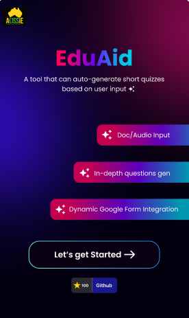

# Google Summer of Code 2024 Final Report

## Introduction

- **Name:** Aditya Dubey
- **GitHub:** [Aditya062003](https://github.com/Aditya062003)
- **Social Profiles:** [Linkedin](https://www.linkedin.com/in/aditya-vinay-dubey/)
- **Organization:** [Australian Open Source Software Innovation and Education (AOSSIE)](https://www.aossie.org/)
- **Project:** [EduAid - Short Quizzes Generator](https://github.com/AOSSIE-Org/EduAid)

## Abstract

During the Google Summer of Code 2024 program, my work focused on significantly enhancing EduAid, an extension designed to generate quizzes from user-provided content. This year, the primary goals were to improve the existing QA pair generation pipeline, expand its functionality to include various question types like short answer, multiple choice, fill-in-the-blank, and boolean(where previously it only supported short answers) and allow users to specify the difficulty level and number of questions. Additionally, major developments included integrating EduAid with additional services such as Google Forms, Google Docs, and Google Meet, as well as introducing a web app that offers the same powerful quiz generation features as the extension. Users can now review their previous work, and easily export the generated QA pairs into Google Forms, making EduAid a more versatile and user-friendly tool for creating educational content.

## Technologies Used

- Python (Backend)
- ReactJs (Frontend)
- PyTorch (Model Training)

## Demo Video

## What work was done

### Revamping extension's UI and Integration with Google Forms
I began the EduAid project by designing the user interface. Using ReactJS and TailwindCSS, I crafted a modern and responsive UI. This combination is popular and widely used, making it easier to keep the interface updated and implement any future changes. The user flow, as outlined in the [Figma design](https://www.figma.com/file/NI0KwTLdGMwzhljmkDOLf5/EduAid?type=design&node-id=0%3A1&mode=design&t=GyPQbQFNJbu7GBFL-1), guides users smoothly through the process. Within the interface, users can:

1. Choose a category for their question-answer pairs.
2. Input content via text or audio.
3. Set the desired difficulty level and the number of questions.
4. Download a PDF of the generated questions.
5. Directly create a Google Form using the generated QA pairs.

*Merged PR* - https://github.com/AOSSIE-Org/EduAid/pull/42

### Difficulty Controllable Question Generation

After setting up the UI, I shifted my focus to training a model that could generate a specified number of questions based on the user’s preferred difficulty level. Since EduAid is designed to run locally, using large language models like GPT-3 or GPT-4 wasn’t feasible due to their closed-source nature and the high costs associated with API calls. Instead, I opted for a more efficient approach, inspired by research on generating questions that can be controlled by difficulty.

The main goal was to automatically generate question-answer pairs (Q, A) from the content provided by the user (C) and a selected difficulty level (d). The difficulty level determines how complex the reasoning needs to be to answer the question:

- Easy questions (d=1): These require just a single fact from the content.
- Medium questions (d=2): These involve connecting two or more facts
- Hard questions (d=3): These require more complex reasoning, linking multiple facts together.

To achieve this, I used the [HotPotQA](https://huggingface.co/datasets/hotpot_qa) dataset, which provides a rich set of questions, answers, difficulty levels, and context. This dataset was perfect for training the T5 model to generate questions that could be easy, medium, or hard, depending on the content provided.

Due to time constraints, I primarily trained the model to generate difficulty controlled short-answer and multiple-choice questions. The system I developed relies on two models:

1. Question-Answer Pair Generation Model: This model is a transformer-based NLP system designed to generate question-answer pairs from a given text. It can produce both full-sentence questions and multiple-choice questions. Answers are derived from sentences and phrases within the input text. For multiple-choice questions, named entities are used as answer options, with incorrect answers being other entities of the same type from the text. Questions are created by combining the extracted answer with the full text (up to a maximum of 512 tokens) as context. This concatenated string is then encoded and input into the question generation model. Named entity recognition is performed using [spaCy](https://spacy.io/), ensuring that the entities used for multiple-choice options are relevant and appropriately challenging.

2. Difficulty Ranking Model: This model assesses the quality and difficulty of the generated question-answer pairs. It assigns a score to each pair, which helps in ranking and filtering them based on difficulty.

Together, these models make EduAid a powerful tool for generating dynamic quizzes that match the user's desired difficulty, providing a practical resource for creating educational content.

*Merged PR* - https://github.com/AOSSIE-Org/EduAid/pull/43

### EduAid's Website

Similar to the extension, the EduAid web app accepts input in text, PDF, and DOC formats, utilizing the same APIs for generating quizzes. Built using ReactJS and TailwindCSS, the web app is designed to be more user-friendly than the extension, making it accessible to a broader audience. It also includes features like saving recent quizzes locally, allowing users to revisit their progress. The web app's ease of use and added convenience can attract more users, making learning more engaging and efficient.

*Merged PR* - https://github.com/AOSSIE-Org/EduAid/pull/50

## What's Next?

During my time working on EduAid, I've seen many of my initial ideas take shape and evolve, and I've even come up with new concepts along the way. As I look ahead, I’m excited about the potential for further development. Even after the Summer of Code wraps up, I plan to dedicate some of my weekends to refining EduAid, adding new features, and enhancing its capabilities. My goal is to keep pushing this project forward so that by the time the next summer rolls around, EduAid will be even more powerful and user-friendly, ready to make an even bigger impact.

## Acknowledgments

First and foremost, I want to express my gratitude to the [AOSSIE](https://www.aossie.org/) community for giving me the opportunity to be part of this journey. I'm also incredibly thankful to my mentor Prarabdh Shukla. His patience and expertise were a huge help in overcoming every challenge, whether big or small. A special thank you goes to our org admin, Bruno, who provided invaluable support throughout my Google Summer of Code experience, handling administrative tasks with ease and offering encouragement whenever I needed it. I truly appreciate all their efforts in making this project a success.
